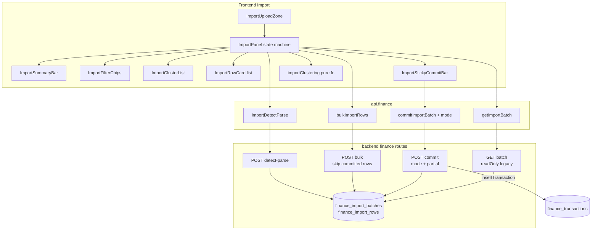
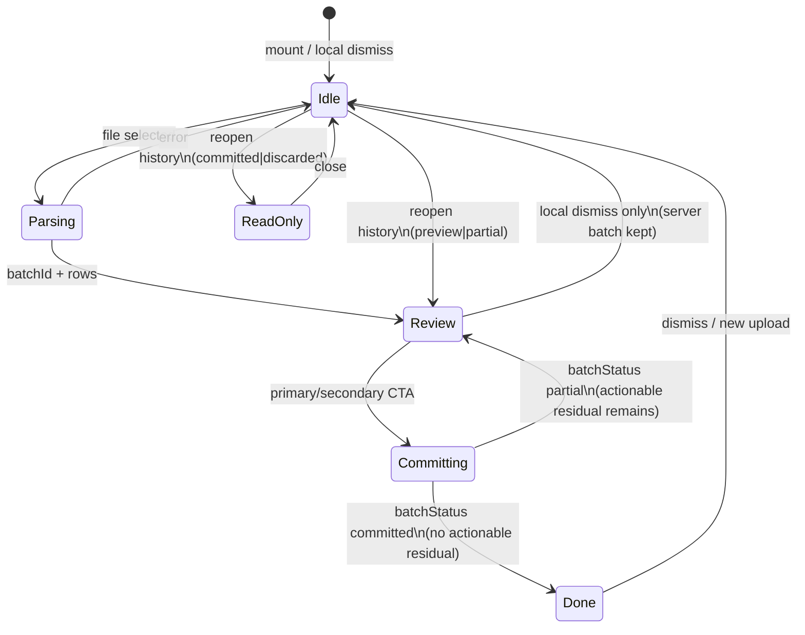
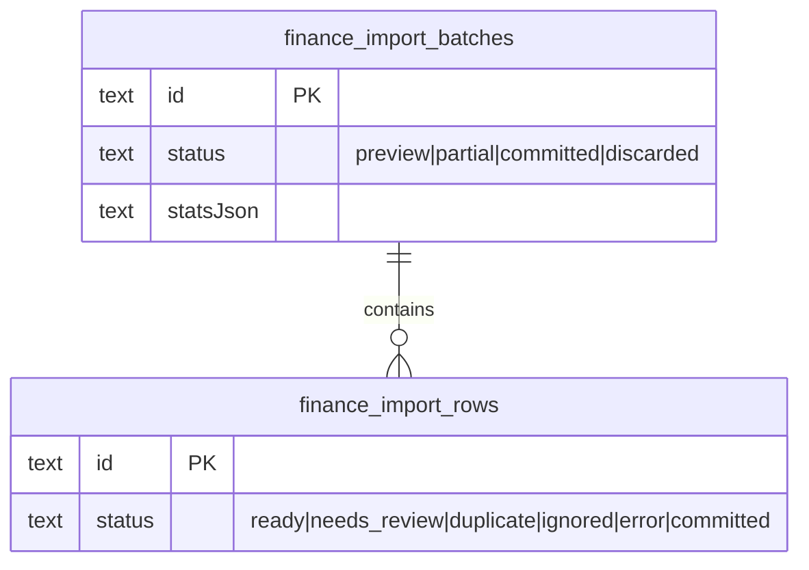

# P0: 账单导入高效复核（便利 × 精准）

| 字段 | 值 |
|------|-----|
| **Document** | Finance Import Efficient Review (P0) |
| **Project** | super-note（蜉蝣） |
| **Author** | TBD |
| **Date** | 2026-07-24 |
| **Status** | Draft（rev 3 — residual-dup UX + sticky height contract） |
| **Related** | `docs/superpowers/specs/finance-ledger-design.md` |

---

## Overview

账单导入后端链路（多渠道 parse → 规则引擎 → 跨源去重 → 还款提示）已可用，但大批量（200–2000 行）场景的瓶颈在 **人工复核闭环**：提交策略把 `needs_review` 与 `ready` 混在同一 CTA 里，待确认行无法按商户批量收敛，移动端缺少摘要流与触控友好的账户选择，筛选与提交栏在长列表中易丢失。

本设计在 **最小后端变更** 前提下完成四项 P0 能力：

1. **提交策略拆分**：主 CTA 仅提交 `status=ready && selected`；次级入口显式包含 `needs_review`（确认对话框）；部分提交后批次保留未提交行，且 **有可操作残差（含 duplicate）时保持 `partial`**。
2. **待确认按商户聚类 + 一键套用**：共享数据层聚类；一键写目标/支付账户（**必须双账户**）；可选存为规则；空对方不进可套用簇。
3. **移动端摘要流 + AccountPicker 底部 sheet**：upload → 摘要卡 → 待确认队列/聚类；sheet 经 portal 挂 body，触控 ≥44px。
4. **筛选 chip 带数量 + sticky 提交栏**：`待确认 (42)` 等计数；提交栏在列表滚动区外、始终可达。

服务端必须强制 `mode` 过滤（尤其 `ready_only`）；bulk/PATCH 拒绝改写已 `committed` 行；聚类与 UI 拆分以客户端为主。

---

## Background & Motivation

### Current state

| 环节 | 现状 | 路径 |
|------|------|------|
| 上传解析 | `POST .../import/detect-parse`，写入 `finance_import_batches`（`status=preview`）+ rows | `backend/src/routes/finance.ts` |
| 行状态 | `ready` / `needs_review` / `duplicate` / `ignored`；规则置信 ≥0.9 且双账户齐全 → ready；还款类强制 needs_review | 同上 ~L1193–1256；类型 `ImportRowStatus` in `backend/src/services/finance/types.ts` |
| 批量改行 | `POST .../import/batches/:id/bulk` 支持 `rowIds`、账户、`selected`、`forceImportDuplicates`；补齐双账户后 `needs_review→ready`；**不**检查 row/batch 终态 | ~L1354–1412 |
| 单行 PATCH | `PATCH .../rows/:rowId` 合并 draft，同样可晋升 ready；**不**检查 committed | ~L1415–1448 |
| 提交 | `POST .../commit`：默认 `selected !== false` 且非 duplicate/ignored/error，**含 needs_review**；成功后 **整批** `status='committed'`，**不**更新行 status | ~L1450–1551 |
| 交易去重索引 | `UNIQUE INDEX idx_fin_tx_source_ref ON finance_transactions(ledgerId, source, sourceRef) WHERE sourceRef IS NOT NULL AND sourceRef != ''` | `migrations.ts` ~L2183–2185 |
| 前端 UI | 单文件 `ImportPanel.tsx`（~780 行） | `frontend/src/components/finance/ImportPanel.tsx` |
| 同商户 | `applySamePayee`：includes 近似 payee，行级按钮 | ImportPanel L195–227 |
| 账户选择 | `AccountPicker` 仅 absolute dropdown；**调用方仅** `ImportPanel` + `FinanceCenter`（记一笔 Modal） | `AccountPicker.tsx` |
| 去重归一 | 前端去 `*`/空白；后端 `dedup.ts` 额外去括号 | 两端略不一致 |
| discard | 后端 `POST .../discard` 存在；**前端无** `api.finance.discardImportBatch` | finance.ts ~L1554 |

### Pain points（量化场景）

- **精度风险**：主按钮文案已写「就绪 N / 待确认 M」，实际却可能把待确认行一并入库。
- **效率**：200 行待确认中常有 15–40 个商户簇；逐行「同商户套用」成本高。
- **移动**：内层 `max-h-[50vh]` 列表 + 顶栏提交滚出视口；dropdown 在滚动容器内被裁切。
- **部分提交不可用**：commit 后批次直接 `committed`，未处理行（含 duplicate 强制导入）无法继续。

### Existing assets to reuse

- `bulkImportRows` — 聚类一键套用无需新 bulk API。
- `commitImportBatch` 已支持 body `rowIds`（部分选择）但 **不支持 mode，且总是整批 committed**。
- `confirm()` from `@/components/ui/confirm` — include_review / 簇套用 / 可选 force-import。
- FinanceCenter / ProjectCenter 底栏 sheet 模式可复用。
- 移动视口惯例：`max-width: 767px`（`useEditorSwipeBack`）。
- DB UNIQUE on `(ledgerId, source, sourceRef)` — 非空 sourceRef 的二次 insert 防线。

---

## Goals & Non-Goals

### Goals

1. 主提交路径 **默认且服务端强制** 只提交 `status === "ready" && draft.selected !== false` 的行。
2. 用户可显式选择「同时导入待确认」，经确认对话框后以 `mode: "include_review"` 提交。
3. 部分提交后：已提交行标记为 `committed` 且不可再改；批次在仍有 **可操作残差**（`ready` / `needs_review` / `duplicate`）时保持 `partial`；stats 刷新；UI 不卸载 batch。
4. `needs_review` 按归一化商户聚类；簇级一键设置 **双账户**；可选「存为规则」；空对方不提供一键套用。
5. 移动端：摘要卡 + 待确认队列/簇优先；AccountPicker sheet（portal）；sticky 提交栏。
6. 筛选 chip 显示各状态计数；桌面/移动同一状态机、不同布局。
7. 实现可直接落地：接口契约、组件边界、PR 切片清晰。
8. Legacy 已 `committed` 批次以只读呈现，无需数据 backfill migration。

### Non-Goals（明确排除，属 P1/P2）

| 项 | 原因 |
|----|------|
| 多文件导入队列 | 单 batch 复核已够 P0 |
| 键盘表格模式 / 快捷键全选编辑 | P1 |
| 历史商户学习（跨 batch 推荐账户） | P1 |
| 系统 Share Intent 导入 | P2 |
| 提交撤销（undo commit） | P0 不提供 |
| 改变 parse / 规则引擎 / 跨源去重算法本身 | 后端解析已稳 |
| 服务端聚类 endpoint | 无跨端共享状态需求 |
| 显式「结束批次 / discard」产品入口 | **P0 不做** FE discard client；假阳性用 **忽略剩余重复**（`markIgnored`→`ignored`，K18）收尾 |
| i18n key 抽取 | 与现 ImportPanel 中文硬编码一致；P0 不引入 |
| draft 存 `createdTxId` | 可选 P1 可支持性增强 |
| FinanceCenter 记一笔在 compact 下改用 sheet | 出 P0；保持默认 dropdown |

---

## Proposed Design

### High-level architecture



### State machine（桌面 / 移动共用）



| State | UI focus | batch.status expected |
|-------|----------|------------------------|
| Idle | 上传区 + 最近导入 | n/a 或历史列表 |
| Parsing | busy spinner | — |
| Review | 摘要 / 筛选 / 簇或行 / sticky 栏 | `preview` 或 `partial` |
| Committing | CTA loading | 不变直至响应 |
| Done | 结果 banner + 链到明细/统计 | `committed`（无可操作残差） |
| ReadOnly | 只读摘要 + 行列表禁用编辑/CTA | `committed` 或 `discarded`（legacy 或终态） |

**ImportPanel 关键本地状态（增补）：**

```ts
// 既有: batchId, rows, stats, filter, search, committing, ...
const [batchStatus, setBatchStatus] = useState<"preview" | "partial" | "committed" | "discarded" | null>(null);
const [readOnly, setReadOnly] = useState(false);
const [selectedClusterId, setSelectedClusterId] = useState<string | null>(null); // mobile 簇详情；null = 列表
// isCompact via useMediaQuery("(max-width: 767px)")
```

**Mobile 簇详情导航：**

- `selectedClusterId === null`：簇列表（或 filter 下的行列表）。
- 点簇 → `setSelectedClusterId(cluster.key)`：详情页展示样例行、双 AccountPicker、`应用到 N 笔`、返回箭头 → `setSelectedClusterId(null)`。
- 切换 filter / 提交成功后清空 `selectedClusterId`。

### 1. Commit policy split + partial commit

#### Behavior

| CTA | Client `mode` | Server selects | Confirm |
|-----|---------------|----------------|---------|
| **主：导入就绪 N 笔** | `ready_only`（默认） | `status === "ready"` && `selected !== false` && 双账户齐全 | 无 |
| **次：含待确认一并导入** | `include_review` | `status ∈ {ready, needs_review}` && `selected !== false` && 双账户齐全 | **必须** `confirm()` |

`rowIds` 与 `mode` 同时存在时：**先 mode + status/selected/accounts 过滤，再与 rowIds 求交**（**有意收紧**旧 `rowIds` 路径——旧代码在提供 `rowIds` 时跳过 status/selected 过滤）。

#### Server algorithm（`POST .../commit`）

**新 body：**

```ts
type CommitBody = {
  mode?: "ready_only" | "include_review"; // default: "ready_only"
  rowIds?: string[];
};
```

**伪代码：**

```ts
const mode = body.mode ?? "ready_only";
if (mode !== "ready_only" && mode !== "include_review") {
  return c.json({ error: "invalid mode" }, 400);
}
if (batch.status === "committed" || batch.status === "discarded") {
  return c.json({ error: "批次不可提交" }, 400);
}

let candidates = loadRows(batchId).filter(
  (r) => r.status !== "committed" && r.status !== "ignored" && r.status !== "error" && r.status !== "duplicate",
);
// duplicate 永不直接 commit；须先 force → needs_review/ready

if (mode === "ready_only") {
  candidates = candidates.filter((r) => r.status === "ready");
} else {
  candidates = candidates.filter((r) => r.status === "ready" || r.status === "needs_review");
}

candidates = candidates.filter((r) => {
  const d = JSON.parse(r.draftJson);
  return d.selected !== false && d.targetAccountId && d.methodAccountId;
});

if (body.rowIds?.length) {
  const set = new Set(body.rowIds);
  candidates = candidates.filter((r) => set.has(r.id));
}

// Zero rows after filter: no-op success, do NOT change batch.status
if (candidates.length === 0) {
  const stats = recomputeImportStats(db, batchId); // optional read-only recompute
  return c.json({
    committed: 0,
    skipped: 0,
    errors: [],
    batchStatus: batch.status, // stay preview|partial
    stats,
    remaining: countActionableResidual(db, batchId),
  });
}

const run = db.transaction(() => {
  let committed = 0, skipped = 0;
  const errors: string[] = [];
  for (const r of candidates) {
    try {
      insertTransaction(...); // may throw on UNIQUE sourceRef
      db.prepare(`UPDATE finance_import_rows SET status = 'committed' WHERE id = ?`).run(r.id);
      // optional P1: merge draft.createdTxId
      committed++;
    } catch (e) {
      skipped++;
      errors.push(`行 ${r.rowIndex + 1}: ${e?.message || e}`);
    }
  }
  const stats = recomputeImportStats(db, batchId);
  const residual = countActionableResidual(db, batchId);
  // residual = COUNT status IN ('ready','needs_review','duplicate')
  // Apply nextBatchStatus table below (do not auto-close when only duplicates remain).
  db.prepare(`UPDATE finance_import_batches SET status = ?, statsJson = ? WHERE id = ?`).run(
    nextBatchStatus,
    JSON.stringify(stats),
    batch.id,
  );
  return { committed, skipped, errors, batchStatus: nextBatchStatus, stats, remaining: residual };
});
```

**`nextBatchStatus` 规则（规范表述）：**

| 条件 | batch.status |
|------|----------------|
| 本次 `committed === 0` | **保持不变**（`preview` 或 `partial`） |
| 本次 `committed > 0` 且存在 actionable residual（`ready` \| `needs_review` \| `duplicate`） | **`partial`** |
| 本次 `committed > 0` 且 **无** actionable residual（仅剩 `committed` / `ignored` / `error` 或空） | **`committed`** |

**关键：仅剩 `duplicate` 时仍为 `partial`**，允许用户 force → 再 commit。此为 **K9 修订**。

#### Residual duplicates UX（假阳性 / 用户已完成）

K9 故意让「仅剩重复」保持 `partial`，以便稍后强制导入。副作用：若用户认定剩余重复均为假阳性、**无事可做**，在 K13（无 FE discard/结束批次）下批次会一直显示「部分导入」直到 24h TTL——这是可接受成本，但必须 **说清楚**，并提供轻量出口（不必 end-batch API）。

**PR2 必做文案（SummaryBar / partial banner / sticky 次要区）：**

当 `batchStatus === "partial"` 且 `stats.duplicate > 0`（尤其 `ready === 0 && needs_review === 0`）时展示：

> 仍有 N 笔疑似重复未处理。批次保持「部分导入」：可稍后强制导入、**忽略剩余重复**，或等待批次过期（约 24h）。  
> 本地关闭导入页不会结束批次，可从「最近导入」继续。

历史列表 `partial` 徽章旁可 tooltip 同义短句。

**P0 推荐出口（非 end-batch）：「忽略剩余重复」→ `ignored`**

| 项 | 约定 |
|----|------|
| 入口 | filter=重复 工具条 / Summary 在「仅剩 duplicate」时的次要按钮 |
| 确认 | `confirm({ title: "忽略剩余 N 笔重复？", description: "将标记为忽略，不再计入待处理；不会写入账本。", danger: false })` |
| API | 扩展 bulk：`{ rowIds?: string[], markIgnored?: true }` 或 `status: "ignored"`；**仅允许**当前 `status === "duplicate"`（及可选已 `selected===false` 的 needs_review——P0 只做 duplicate）的行；skip `committed` |
| 服务端 | 设 `status=ignored`；`recomputeImportStats`；若 `countActionableResidual === 0` 且（`stats.committed > 0` 或原 `batch.status === "partial"`）→ **`batch.status = "committed"`**；否则保持 `preview`/`partial` |
| 前端 | `refreshRows`；若 `batchStatus === "committed"` → Done banner（与 commit 清空一致） |

这 **不** 违背 K13（仍无「丢弃批次 / 丢弃未导数据」专用 API）；只是把假阳性 duplicate 移出 residual，使 K9 的「无残差 → committed」自然达成。

**反例：** 仅 `draft.selected = false` **不** 降低 residual（duplicate 仍算 actionable）——避免用户误以为取消勾选即可「完成批次」。

**行状态扩展：** `ImportRowStatus` 增加 `"committed"`（更新 `backend/src/services/finance/types.ts`）。

**批次状态扩展：**

| status | 含义 |
|--------|------|
| `preview` | 解析后尚未成功提交过任何行 |
| `partial` | 至少成功提交过一行，仍有可操作残差（含 duplicate） |
| `committed` | 无可操作残差（含：用户已忽略全部剩余重复） |
| `discarded` | 丢弃（仅后端/历史；P0 FE 不新增 discard 入口） |

#### Commit acceptance matrix

| 输入 | 结果 |
|------|------|
| `mode` 缺省 | `ready_only` |
| `mode: "nope"` | **400** `{ error: "invalid mode" }` |
| batch `committed` / `discarded` | **400** |
| ready_only，存在 ready 选中双账户 | 提交这些行 → row `committed`；若仍有 needs_review/duplicate/ready → `partial`；否则 `committed` |
| ready_only，仅 needs_review + duplicate | `committed:0`，batch 状态 **不变** |
| ready_only 成功清空全部 ready，仍有 duplicate | `partial`，`remaining` 含 duplicate 数 |
| include_review，ready+needs_review 双账户 | 一并提交；残差规则同上 |
| `rowIds` 含 needs_review 但 mode=ready_only | 交集后 **不**提交该 needs_review |
| `rowIds` 含已 committed | 过滤掉，不二次 insert |
| insert 触发 UNIQUE sourceRef | 该行 skip + error；**不**标 committed；其他行继续 |
| 全部成功且无 residual | `batchStatus: "committed"` |
| bulk `markIgnored` 清空全部 duplicate，且已有 committed 行 | residual 0 → **`batchStatus: "committed"`**（无需再 commit） |

#### Stats refresh

```ts
function recomputeImportStats(db, batchId): Stats {
  // COUNT by status including committed
  // preserve crossDup / channel / detectConfidence from prior statsJson when useful
  return { total, ready, needs_review, duplicate, ignored, committed, crossDup?, channel?, detectConfidence? };
}

function countActionableResidual(db, batchId): number {
  // status IN ('ready','needs_review','duplicate')
}
```

**`remaining` 定义：** actionable residual 行数 = `ready + needs_review + duplicate`（**含** duplicate，便于 UI「仍有 N 笔待处理」）。

响应带回 `stats`；前端 `setStats` + `refreshRows()` + `setBatchStatus`；**partial 时不** `setBatchId(null)`；仅 `batchStatus === 'committed'` 时进入 Done（可清编辑区）。

#### Client commit flow

```ts
await api.finance.commitImportBatch(ledgerId, batchId, { mode: "ready_only" }, token);
// secondary:
const ok = await confirm({
  title: "同时导入待确认行？",
  description: `将额外提交 ${reviewCount} 笔尚未充分确认的记录…`,
  confirmText: "仍要导入",
  danger: true,
});
```

**预览合计 `commitPreview` 拆分**（可抽 pure helper 减 PR 冲突）：

- `readySelectedCount` / expense / income — 主 CTA
- `reviewSelectedCount` — 次级角标
- 不再把 needs_review 计入主 CTA

#### Double-import protection（defense-in-depth）

| 层 | 措施 |
|----|------|
| 1. Row status | 成功 `insertTransaction` 后 **同一事务内** `UPDATE status='committed'`；mode/filter 排除 `committed` |
| 2. Batch gate | `committed` / `discarded` 批次拒绝 commit |
| 3. UNIQUE sourceRef | `idx_fin_tx_source_ref`：非空 `sourceRef` 重复 insert 抛错 → skip/error；**空 sourceRef 不受索引保护**，故层 1 仍必需 |
| 4. Transaction | 整次 commit 单 DB transaction；循环内逐行成功标记 committed；失败行不标记 |

**不再声称「不依赖 UNIQUE」**——UNIQUE 是第 3 道防线，但 **不能**替代 row status。

### 1b. Mutation guards（bulk / PATCH）— PR1 必须

```ts
// bulk:
if (batch.status === "committed" || batch.status === "discarded") {
  return c.json({ error: "批次已结束，不可修改" }, 400);
}
for (const r of rows) {
  if (r.status === "committed") continue; // skip; do not count as updated ideally
  // ... existing draft merge; never demote committed
}

// PATCH row:
if (batch.status === "committed" || batch.status === "discarded") return 400;
if (row.status === "committed") return c.json({ error: "行已导入，不可修改" }, 400);
```

| 操作 | committed 行 | committed/discarded batch |
|------|--------------|---------------------------|
| GET | 返回（见 legacy 呈现） | 允许只读 |
| bulk | **skip**（不写入）；`updated` 不含之 | **400** |
| PATCH | **400** | **400** |
| commit | 过滤掉 | **400** |
| forceImportDuplicates | 仅非 committed 的 duplicate | batch 终态 400 |

**测试（PR1 必需）：** commit ready → bulk 同 rowIds → `updated === 0` 或仅未提交行；row status 仍为 `committed`。

### 1c. Legacy committed batches（无 migration）

旧数据：batch.`committed` 但行仍为 `ready`/`needs_review`。

**GET `.../batches/:batchId` 兼容：**

```ts
const readOnly = batch.status === "committed" || batch.status === "discarded";
const rows = mapped.map((r) => {
  if (readOnly && r.status !== "committed" && r.status !== "ignored" && r.status !== "error") {
    // presentational only — do not UPDATE DB
    return { ...r, status: r.status === "duplicate" ? "duplicate" : "committed", // or keep raw + flag
      // Prefer: keep raw status, set row.readOnly via batch flag
    };
  }
  return r;
});
return {
  batch: { ..., status, stats, readOnly },
  rows,
  readOnly, // top-level convenience
};
```

**推荐呈现（避免改写历史语义）：**

- 响应增加 `readOnly: boolean`（`batch.status ∈ {committed, discarded}`）。
- **不**在 GET 时写库 backfill。
- FE：`readOnly` 时禁用 AccountPicker / 勾选 / bulk / 提交 CTA；可展示「已完成导入（只读）」；duplicate 在只读下也不可 force（K9：终态 batch 不可 mutation——与 partial 残差路径区分）。

**历史列表：**

| status | 徽章 | 点击 |
|--------|------|------|
| `preview` | 预览 | 进入 Review |
| `partial` | **部分导入** | 进入 Review，继续编辑 |
| `committed` | 已完成 | 只读打开 **或** 不打开仅展示摘要——P0：**允许只读打开** |
| `discarded` | 已丢弃 | 只读或禁用 |

### 2. Payee clustering（client-side）

#### Shared pure module

**唯一前端 normalize 源：** `frontend/src/lib/finance/importClustering.ts`

```ts
/** Align with backend/src/services/finance/dedup.ts normalizePayee */
export function normalizePayee(s: string | null | undefined): string {
  return (s || "")
    .replace(/\*+/g, "")
    .replace(/\s+/g, "")
    .replace(/[（(].*?[）)]/g, "")
    .toLowerCase();
}

export type PayeeCluster = {
  key: string;           // non-empty normalized payee only for applyable clusters
  displayPayee: string;
  rowIds: string[];
  rows: ImportRowView[];
  totalMinor: number;
  count: number;
  commonTargetId?: string;
  commonMethodId?: string;
  applyable: boolean;    // false for empty-payee bucket
};

export function clusterNeedsReview(rows: ImportRowView[]): {
  clusters: PayeeCluster[];      // applyable only, sort count desc, totalMinor desc
  unclustered: ImportRowView[];  // empty/weak payee — row-level only
} {
  // filter status === 'needs_review'
  // key = normalizePayee(...)
  // if !key → unclustered (NOT a mega-cluster, no one-shot apply)
  // else group exact key
}
```

**ImportPanel：** 删除本地 `normalizePayee`，改为 `import { normalizePayee } from "@/lib/finance/importClustering"`。  
**`applySamePayee`：** 继续用 **includes** 近似匹配（K11）；注释标明与簇精确 key 的差异；normalize 函数共用。

#### 空对方 / 弱对方（K14）

- **禁止** `__empty__` 一键套用。
- UI：区块「无对方（N）」仅列表，逐行编辑。
- 可选：`count > 20` 的可套用簇，确认框额外强调金额合计（见下）。

#### 簇操作（PR3 验收）

```ts
async function applyCluster(
  cluster: PayeeCluster,
  patch: { targetAccountId: string; methodAccountId: string }, // BOTH required
) {
  if (!cluster.applyable) return;
  if (!patch.targetAccountId || !patch.methodAccountId) {
    onError("请同时选择分类账户与支付账户");
    return;
  }
  const ok = await confirm({
    title: `应用到 ${cluster.count} 笔？`,
    description: `对方「${cluster.displayPayee}」等 · 合计 ¥${yuan(cluster.totalMinor)}\n将设置分类与支付账户并勾选导入。`,
    confirmText: "应用",
  });
  if (!ok) return;
  // Re-filter to needs_review only (defense after refresh races)
  const rowIds = cluster.rowIds; // server skips committed
  await api.finance.bulkImportRows(ledgerId, batchId, {
    rowIds,
    targetAccountId: patch.targetAccountId,
    methodAccountId: patch.methodAccountId,
    selected: true,
    // NEVER forceImportDuplicates here
  }, unlockToken);
  await refreshRows();
}
```

**规则：**

- 双账户齐全才 enable「应用到 N 笔」。
- 确认文案含 **N、样例对方、totalMinor**。
- 簇路径 **永不** 调用全局 `forceImportDuplicates`（无 rowIds 的 batch 级 force 仍仅在显式「强制导入重复」按钮）。
- bulk **不**更新 `statsJson`（K8）；FE 以 `rows` reduce 为准；`refreshRows()` 必须。
- P0 不做簇内反选；确认前摘要即最小保障。

**存为规则：** 勾选时 `saveImportRule`，逻辑对齐现有行级（ImportPanel L736–768）。

#### UI 差异

| | Desktop (`md+`) | Mobile (`< md`) |
|--|-----------------|-----------------|
| 入口 | filter=待确认时顶部可折叠簇列表 | 摘要下簇列表；`selectedClusterId` 详情 |
| 套用 | 簇头双 picker + 应用（双账户才可点） | 详情内 sheet picker + 确认 |
| 空对方 | 「无对方」扁平列表 | 同 |
| 返回 | n/a | 详情顶栏返回 |

### 3. Mobile flow + AccountPicker sheet

#### Breakpoint

- `const isCompact = useMediaQuery("(max-width: 767px)")`（可新建 `hooks/useMediaQuery.ts`）。
- Import 布局分界 **md / 768px**。

#### Mobile lightweight flow

1. 无 batch：紧凑上传 + 规则折叠 + 历史（partial 徽章）。
2. 有 batch 且可编辑：SummaryBar（就绪大号 / 待确认 / 重复残差）。
3. 默认 filter：`needs_review` 若 M>0，否则 `ready`。
4. 待确认：`ImportClusterList`；点簇 → 详情（`selectedClusterId`）。
5. StickyCommitBar 在 **列表面板外**（见 §4 DOM）。

#### AccountPicker `variant`（PR4 验收标准）

```ts
type AccountPickerProps = {
  // ...existing
  variant?: "dropdown" | "sheet"; // default "dropdown"
  sheetTitle?: string;
};
```

| 项 | 要求 |
|----|------|
| **Portal** | `createPortal(..., document.body)` — **必须**；FinanceCenter `overflow-y-auto` 与 Import 内列表会裁切 absolute |
| **z-index** | 遮罩/面板 **≥ 60**（高于 FinanceCenter modal `z-50` 与 sticky bar），或统一 `z-[60]` |
| **Dismiss** | 点遮罩关闭；`Escape`；打开时可选简单 focus 移入搜索框 |
| **Scroll lock** | `open` 时 `document.body.style.overflow = 'hidden'`，cleanup 恢复 |
| **safe-area** | 面板 `padding-bottom: max(12px, env(safe-area-inset-bottom))` |
| **a11y** | 面板 `role="dialog"` `aria-modal="true"` `aria-label={sheetTitle \|\| placeholder}` |
| **触控** | 仅 `variant==="sheet"` 时触发器 `min-h-[44px]`、选项 `py-3`；**dropdown 尺寸不变** |
| **调用方** | **仅** `ImportPanel`（compact→sheet）与 `FinanceCenter` 记一笔（**保持默认 dropdown**，P0 不改）。**无 RulesPanel**（RulesPanel 用原生 `<select>`） |

检测：Import 内 `pickerVariant = isCompact ? "sheet" : "dropdown"`；不在 AccountPicker 内自动侦测视口。

### 4. Filter chips with counts + sticky commit bar

#### Counts

```ts
const statusCounts = useMemo(() => {
  const c = { all: rows.length, needs_review: 0, ready: 0, duplicate: 0, ignored: 0, committed: 0 };
  for (const r of rows) if (r.status in c) (c as any)[r.status]++;
  return c;
}, [rows]);
// Prefer rows reduce over stale batch.stats for chips
```

- Chip：`待确认 (N)`、`就绪 (N)`、`重复 (N)`、`忽略 (N)`、`全部`；partial 后 **`已导入 (N)`** 可选 filter，默认列表 **隐藏** committed，选「已导入」或「全部」时展示且 **禁用编辑**（K12）。

#### Sticky bar DOM structure（关键）

当前问题：CTA 在列表上方，列表 `max-h-[50vh] overflow-y-auto`，长列表时提交依赖上滚。

**FinanceCenter 高度契约（PR5a 必改，否则 sticky 失败）：**

现状：`FinanceCenter` 内容区为 `flex-1 min-h-0 overflow-y-auto`（~L547），所有 tab 共享外层滚动 → ImportPanel 高度随内容撑开，页脚只能滚到列表末尾才出现，**无法**「始终可达」。

| tab | 内容区 class（示意） |
|-----|----------------------|
| **`import`** | `flex-1 min-h-0 flex flex-col overflow-hidden`（**关闭**外层滚动；高度边界交给子树） |
| 其他 tab | 保持 `flex-1 min-h-0 overflow-y-auto` |

```tsx
// FinanceCenter.tsx — tab body
<div
  className={cn(
    "flex-1 min-h-0",
    tab === "import" ? "flex flex-col overflow-hidden" : "overflow-y-auto",
  )}
>
  {tab === "import" && (
    <ImportPanel className="flex-1 min-h-0 flex flex-col" ... />
  )}
  ...
</div>
```

**ImportPanel 目标结构（Review 态；父级已 bounded height）：**

```
div.import-panel.flex.flex-col.min-h-0.flex-1.h-full
  div.import-scroll.flex-1.min-h-0.overflow-y-auto
    SummaryBar          // partial + residual-dup 文案见上节
    FilterChips
    Bulk tools          // 含「忽略剩余重复」
    ClusterList / RowCards   // 去掉 max-h-[50vh]
  ImportStickyCommitBar.shrink-0.border-t
    // 非 position:fixed；作为 flex 底栏始终占位可见
    // pb-safe; 主 CTA + 次要链接 + 金额预览
```

- Sticky bar 是 **scroll 容器的兄弟**，不是 `max-h` 列表的子节点。
- 在 import-tab 高度契约下，底栏用 **`shrink-0` flex 子项**即可始终可见；`sticky bottom-0` 仅为增强，**不**依赖 FinanceCenter 外层滚动。
- **禁止** 全屏 `position:fixed` 提交栏（与壳层 / 解锁层叠风险）。
- FinanceCenter 为 **顶栏 tab**，非底 tab；仍加 safe-area。
- `disabled`：主按钮 `readyCount === 0`；次要在无双账户 review/ready 时隐藏。
- **验收：** 375px 视口、50+ 行时，主 CTA **无需滚到列表底部** 即可见可点。

### Component boundaries

```
frontend/src/components/finance/
  ImportPanel.tsx
  import/
    types.ts
    ImportUploadZone.tsx
    ImportSummaryBar.tsx
    ImportFilterChips.tsx
    ImportClusterList.tsx
    ImportRowCard.tsx
    ImportStickyCommitBar.tsx
  AccountPicker.tsx
frontend/src/lib/finance/importClustering.ts   # normalizePayee + clusterNeedsReview
frontend/src/hooks/useMediaQuery.ts            # optional extract
```

| Component | 职责 | 主要 props |
|-----------|------|------------|
| `ImportUploadZone` | 拖拽/文件/渠道/规则 | `busy`, `onFile`, rules |
| `ImportSummaryBar` | 渠道、stats、partial「已导入 a · 剩余 b」、**残差重复说明文案**、readOnly 徽章 | `stats`, `batchStatus`, `readOnly`, `duplicateResidualHint` |
| `ImportFilterChips` | filter + counts + search | `filter`, `counts`, `search` |
| `ImportClusterList` | 簇列表/详情套用 | `clusters`, `unclustered`, `selectedClusterId`, `onSelectCluster`, `onApply`, `pickerVariant` |
| `ImportRowCard` | 单行；readOnly 禁用 | `row`, `readOnly`, callbacks |
| `ImportStickyCommitBar` | 主/次提交 | `readyPreview`, `onCommitReady`, `onCommitIncludeReview`, `hidden` if readOnly |
| `ImportPanel` | 编排；对外 props 不变 | — |

### Optimistic row status（drive-by PR2/PR3）

```ts
// AccountPicker onChange — align with server promote rules
const nextDraft = { ...r.draft, targetAccountId: id };
const both = nextDraft.targetAccountId && nextDraft.methodAccountId;
const nextStatus =
  r.status === "needs_review" && both ? "ready" :
  r.status === "ready" && !both ? "needs_review" :
  r.status;
```

禁止在仅有单账户时本地标 `ready`。

### Desktop vs mobile layout sketch

**Desktop (md+):**

```
[Stepper]
[Upload — collapsible when batch]
[SummaryBar]
[FilterChips + search + force-dup]
[Bulk account row]
[Clusters if needs_review]
[Rows — outer scroll]
[StickyCommitBar sibling]
```

**Mobile:**

```
[SummaryBar hero]
[FilterChips scroll-x]
[Cluster list OR cluster detail OR rows]
[StickyCommitBar + safe-area]
AccountPicker → body portal sheet
```

---

## API / Interface Changes

### `POST .../commit`

**Request:**

```json
{ "mode": "ready_only", "rowIds": ["optional"] }
```

| Field | Default | Notes |
|-------|---------|-------|
| `mode` | `ready_only` | 非法值 **400**；与 FE 同发 |
| `rowIds` | 全部候选 | 与 mode 过滤 **求交**（收紧旧行为） |

**Response:**

```json
{
  "committed": 120,
  "skipped": 2,
  "errors": ["行 15: ..."],
  "batchStatus": "partial",
  "stats": { "total": 500, "ready": 10, "needs_review": 40, "duplicate": 5, "ignored": 3, "committed": 120 },
  "remaining": 55
}
```

`remaining` = actionable residual（ready + needs_review + duplicate）。

### `POST .../bulk` / `PATCH .../rows/:rowId`

- 见 §1b mutation guards（**有意变更**）。
- **Body 增补 `markIgnored?: boolean`**（P0 假阳性出口，K18）：
  - 将目标行（默认所有 `duplicate`，或与 `rowIds` 求交）设为 `status=ignored`；skip `committed`。
  - 成功后 `recomputeImportStats`；若 residual=0 且已有 committed 行（或原 batch 为 `partial`）→ `batch.status=committed`。
  - 响应建议：`{ updated, batchStatus?, stats? }`（ignore / 账户变更导致终态变化时务必带上）。
- 账户类 bulk（簇套用）仍可不强制写 statsJson；FE `refreshRows` + 本地 reduce（K8）。**`markIgnored` 与 commit 路径必须写回 stats / batchStatus。**

### `GET .../batches/:batchId`

- 增加 `readOnly: boolean`（及 `batch.readOnly`）。
- 无强制 row backfill。

### `api.finance`（`frontend/src/lib/api.ts`）

```ts
commitImportBatch(ledgerId, batchId, body?: {
  mode?: "ready_only" | "include_review";
  rowIds?: string[];
}, unlockToken?) => Promise<{
  committed: number;
  skipped: number;
  errors: string[];
  batchStatus?: string;
  stats?: Record<string, number>;
  remaining?: number;
}>;

bulkImportRows(ledgerId, batchId, body: {
  rowIds?: string[];
  targetAccountId?: string;
  methodAccountId?: string;
  selected?: boolean;
  forceImportDuplicates?: boolean;
  markIgnored?: boolean;
}, unlockToken?) => Promise<{
  updated: number;
  batchStatus?: string;
  stats?: Record<string, number>;
}>;

// getImportBatch 类型扩展 readOnly?: boolean
// 不新增 discardImportBatch（P0）
```

### `backend/src/services/finance/types.ts`

```ts
export type ImportRowStatus =
  | "ready"
  | "needs_review"
  | "duplicate"
  | "ignored"
  | "error"
  | "committed";

export type ImportBatchStatus =
  | "preview"
  | "partial"
  | "committed"
  | "discarded";
```

### Clustering endpoint

**不新增。**

### Stats

- commit 内 `recomputeImportStats` 写回。
- 账户类 bulk：**可不**写 statsJson；FE rows reduce（K8）。
- **`markIgnored` bulk：必须**写回 `statsJson` 与可能的 `batchStatus`（与 commit 同级正确性）。

---

## Data Model Changes



**Migration：** 无。TEXT 状态 + 类型更新即可。

**TTL：** 24h；`partial` 同样适用。

---

## Alternatives Considered

### A1. 仅前端过滤 commit 的 rowIds，后端不改 mode

- **结论：拒绝**作唯一方案；mode + 行 status 必须服务端强制。

### A2. 默认 mode 保持 `include_review`

- **结论：拒绝**；安全默认错误。

### A3. 服务端聚类 API

- **结论：P0 不做。**

### A4. 拆 batch 承载已提交行

- **结论：拒绝**；行级 `committed` + batch `partial` 更简单。

### A5. AccountPicker 拆成两个组件

- **结论：单组件 variant**；默认 dropdown。

### A6. 残差 duplicate 与 batch 终态策略

| 方案 | 做法 | 评价 |
|------|------|------|
| **A6-1（采纳）** | 存在 `duplicate`（或 ready/needs_review）→ 保持 `partial`；允许 force→commit；假阳性用 **ignore→committed** + 文案（K18） | **P0 推荐**：保住「先导就绪、再处理重复」，且不挂死至 TTL |
| A6-2 | K9 旧案：仅剩 duplicate 即 batch `committed` + 主 CTA 强警告 | 破坏既有 force 流程；需用户永远先处理重复 |
| A6-3 | 允许 `committed` batch 上 residual force/commit | 状态机复杂；与只读 legacy 冲突 |

**结论：采纳 A6-1 + K18 出口**；修订原 K9。

---

## Key Decisions

| # | Decision | Rationale |
|---|----------|-----------|
| K1 | Commit `mode` 默认 `ready_only`，非法 400，服务端强制 | 精准核心；不可仅信前端 |
| K2 | 部分提交：row.`committed` + batch.`partial`，无 DB migration | TEXT 已够用 |
| K3 | 聚类纯客户端 + 精确 normalize key | 无服务器状态；复用 bulk |
| K4 | 前端 **唯一** `normalizePayee` 模块，与 `dedup.ts` 对齐 | 避免双实现漂移 |
| K5 | AccountPicker `variant` 调用方传入，默认 `dropdown`；sheet 必须 portal | 保护 FinanceCenter 记一笔；裁切修复 |
| K6 | 布局分界 767px；同一状态机 | 与 useEditorSwipeBack 一致 |
| K7 | 主 CTA = ready∩selected∩双账户；次级 include_review + danger confirm | 文案与行为一致 |
| K8 | bulk 后 stats 客户端 rows 派生；commit 服务端写回 | 缩小 bulk 范围 |
| **K9** | **存在 actionable residual（ready \| needs_review \| duplicate）则 batch 不得最终 `committed`**；仅无残差才 `committed`（含 ignore 清空 duplicate 后）。终态 batch 拒绝 commit/bulk/PATCH | 保住「先就绪后重复」；假阳性用 ignore 收尾 |
| K10 | ImportPanel 拆子组件但对外 props 不变 | FinanceCenter 无感 |
| **K11** | 保留行级 `applySamePayee` **includes** 匹配；簇用精确 key | 行级宽松补漏 vs 簇级防误套 |
| **K12** | `committed` 行在「全部/已导入」可见且 **禁用编辑**；默认列表可隐藏 | 避免「行消失」困惑 |
| **K13** | P0 dismiss = **仅清本地 UI**；服务器 `partial` 保留；历史可 reopen。**不**做 FE discard/结束批次 API | 减范围；假阳性用「忽略重复」而非 discard |
| **K14** | 空 payee **不**进入可一键套用簇；仅 unclustered 逐行 | 防 mega-cluster 误分类 |
| **K15** | Legacy `committed` batch：GET `readOnly`，无 backfill migration | 零迁移成本 |
| **K16** | 簇 apply **必须**双账户 + confirm(N+金额)；永不全局 force | 精度 |
| **K17** | PR1+PR2 **同发**；禁止只上后端 mode 默认 | 避免旧 UI 文案撒谎 |
| **K18** | partial 且仍有 duplicate：**必显说明文案**；提供「忽略剩余重复」→ `ignored` 以清空 residual 并可达 `committed`。仅 uncheck **不**清 residual | 关闭 TTL 挂起；不引入 end-batch |
| **K19** | import tab：FinanceCenter `overflow-hidden` + flex 高度契约；Import 自管 scroller；底栏 shrink-0 始终可见 | sticky「始终可达」的前提 |

---

## Security & Privacy Considerations

| 威胁 | 严重度 | 缓解 |
|------|--------|------|
| 伪造 mode 导入低质量数据 | Medium | 默认 ready_only；include_review 显式 |
| 重复 commit 双花 | High | row committed + batch gate + UNIQUE sourceRef + 事务 |
| 改写已导入行 draft | High | bulk skip / PATCH 400 |
| 簇误套用 | Medium | 精确 key；禁空簇；双账户+confirm；N+金额 |
| Unlock token | Existing | 既有 header |
| 导入文件 | Existing | TTL |

---

## Observability

| 信号 | 方式 |
|------|------|
| commit | log `batchId mode committed skipped remaining batchStatus` |
| partial | `batchStatus=partial` |
| mutation reject | log bulk/PATCH 400 on terminal batch |

**成功指标（轻量，非强制 APM）：**

- 主路径 ready_only 占比；partial 后再 commit 次数；平均每 batch commit 次数。

P0 无新告警管道。

---

## Rollout Plan

1. **禁止单独部署 PR1**：checklist「PR1 与 PR2 同发」；否则旧按钮「就绪 N / 待确认 M」只导 ready，文案误导。
2. Feature flag 可选：`finance.import.readyOnlyDefault` 默认 true；一般不需要。
3. Staged：内部 500+ 行账单验证 ready_only → force residual duplicate → 二次 commit。
4. Rollback：回滚 BE+FE；行上 `committed` 对旧代码近似「非 selected 路径」跳过，无害。
5. Changelog + 可选结果 banner 一句：「默认仅导入就绪行；待确认请先处理或显式包含。」
6. Legacy 批次只读，无需 SQL backfill。

---

## Risks

| Risk | Severity | Mitigation |
|------|----------|------------|
| 部分提交 double-import | High | 三层防线 + PR1 必测 |
| 仅剩 duplicate 被误标 committed | High（已修） | K9/A6-1：residual 含 duplicate |
| 簇 over-apply / 空对方 mega-cluster | Medium | 精确 key；K14；confirm |
| ready_only 行为变化 | Medium | K17 同发；次级 CTA |
| 乐观 status 闪烁 | Low→fixed | 双账户才 ready |
| Sticky 布局套叠 | Low | bar 与 scroller 兄弟；非 fullscreen fixed |
| partial 用户以为完成 / 假阳性 duplicate 挂起至 TTL | Medium（已缓解） | K18 文案 +「忽略剩余重复」；历史徽章 |
| include_review 缺账户 | Low | skip + errors |
| import 外层仍 overflow-y-auto 导致底栏不可达 | Medium（已缓解） | K19 / PR5a FinanceCenter 高度契约 + 验收 50+ 行 |

---

## Open Questions

（原 Q1/Q2/Q4 已落入 Key Decisions K11–K13/K15。保留可延后项：）

1. **Feature flag**：默认不需要；仅当必须 BE 先于 FE 灰度时启用（应避免，见 K17）。
2. **P1：** draft.`createdTxId` 是否写入便于客服对账。
3. **P1：** FinanceCenter 记一笔 compact 是否改 sheet。

---

## Testing Plan

### Backend（PR1 **必需**，非 optional）

- `mode` ready_only 不提交 needs_review
- include_review 提交 ready+needs_review
- 非法 mode → 400
- 默认 `{}` ≡ ready_only
- 二次 commit：已 committed 行不重复 insert；UNIQUE 冲突 → skip
- ready_only 后仅剩 duplicate → `batchStatus=partial`，`remaining` 含之
- force duplicate → needs_review → commit → residual 0 → `committed`
- zero candidates → `committed:0`，batch 保持 preview/partial
- mode ∩ rowIds：ready_only + needs_review id → 不提交
- bulk/PATCH 对 committed 行 skip/400；terminal batch 400
- GET legacy committed → `readOnly: true`
- bulk `markIgnored` 全部剩余 duplicate → residual 0 → `batchStatus=committed`（有 prior committed 行时）
- 仅 `selected=false` 的 duplicate **仍**计入 residual

文件：`backend/src/routes/__tests__/finance-import-commit.test.ts`（**required**）

### Frontend

- `clusterNeedsReview`：空 payee → unclustered；括号/星号；排序；applyable
- commitPreview 与主按钮一致；CTA disabled 态
- 乐观 status 仅双账户
- AccountPicker sheet：portal 打开/Escape/遮罩；dropdown 默认尺寸不变（FinanceCenter）
- 历史：partial 徽章 reopen 可编辑；committed reopen 只读
- partial + only-duplicates：文案可见；「忽略剩余重复」后进入 Done
- sticky：bar 在 scroller 外；**FinanceCenter import tab overflow-hidden** 下 50+ 行 CTA 始终可见
- mobile：`selectedClusterId` 进入/返回

### Manual QA

- 200+ 行：簇套用 → 就绪 → ready_only → 处理重复 → 再 commit
- 375px：sheet、sticky、簇详情返回
- 旧 committed 历史只读

---

## References

- Spec: `docs/superpowers/specs/finance-ledger-design.md`
- Frontend: `ImportPanel.tsx`, `AccountPicker.tsx`, `FinanceCenter.tsx`
- API: `frontend/src/lib/api.ts` → `api.finance.*`
- Backend: `backend/src/routes/finance.ts`
- Types: `backend/src/services/finance/types.ts`（`ImportRowStatus`）
- Dedup: `backend/src/services/finance/dedup.ts`
- UNIQUE: `migrations.ts` `idx_fin_tx_source_ref`
- Confirm: `frontend/src/components/ui/confirm.tsx`

---

## PR Plan

### PR1 — Commit mode + partial + mutation guards（backend）

- **Title:** `fix(finance): import commit mode, partial batches, protect committed rows`
- **Files:**
  - `backend/src/routes/finance.ts` — commit / bulk / PATCH / GET readOnly
  - `backend/src/services/finance/types.ts` — `ImportRowStatus` + `ImportBatchStatus`
  - `backend/src/routes/__tests__/finance-import-commit.test.ts` — **required**
- **Dependencies:** none
- **Description:** `mode` 默认 ready_only；非法 400；行 `committed`；residual 含 duplicate → `partial`；zero-row no-op；bulk skip committed / terminal 400；GET `readOnly`；stats recompute；defense-in-depth 含 UNIQUE。bulk 支持 `markIgnored`：duplicate→ignored；residual 清空且已有导入行时 batch→`committed`。测试覆盖 ignore 收尾路径。

### PR2 — API client + commit CTA split + history badges

- **Title:** `feat(finance): import ready_only CTAs, partial retain, history badges`
- **Files:**
  - `frontend/src/lib/api.ts`
  - `frontend/src/components/finance/ImportPanel.tsx`
  - 可选 early：`frontend/src/lib/finance/commitPreview.ts` pure helpers
- **Dependencies:** PR1（**同发**，K17）
- **Description:** 主/次 CTA；confirm include_review；partial 保留 batch；history `部分导入`/`已完成`；readOnly 禁用；乐观 status 双账户修复；可选 force-import 改用 `confirm()`。**K18 文案**：partial + residual duplicates 时 Summary/banner 固定提示（强制导入 / 忽略 / TTL）。「忽略剩余重复」可与 PR1 bulk `markIgnored` 同发或紧随：confirm → bulk → 若 batch 变 committed 则 Done。

### PR3 — Payee clustering + one-shot apply

- **Title:** `feat(finance): cluster needs_review by payee and one-shot apply`
- **Files:**
  - `frontend/src/lib/finance/importClustering.ts`（**唯一** normalize）
  - `ImportPanel.tsx`（簇 UI；删本地 normalize）
  - `importClustering.test.ts`
- **Dependencies:** PR2 建议基于；可部分并行
- **Description:** 精确簇；unclustered 空对方；双账户+confirm；禁全局 force；可选存规则；保留 applySamePayee includes。

### PR4 — AccountPicker sheet variant

- **Title:** `feat(finance): AccountPicker sheet variant (portal)`
- **Files:**
  - `frontend/src/components/finance/AccountPicker.tsx`
- **Dependencies:** none（可最先合）
- **Description:** portal body、z≥60、dismiss、scroll lock、safe-area、a11y；默认 dropdown 不变；**不改** FinanceCenter 调用点。

### PR5a — Filter chip counts + sticky commit bar

- **Title:** `feat(finance): import filter counts and sticky commit bar`
- **Files:**
  - **`frontend/src/components/finance/FinanceCenter.tsx`** — import tab 高度契约：`tab === "import"` 时内容区 `flex flex-col overflow-hidden`，其它 tab 保持 `overflow-y-auto`（**K19**）
  - `ImportPanel.tsx`（`flex-1 min-h-0 flex flex-col`；scroller + bar 兄弟；去 max-h-[50vh]）
  - 可选 `import/ImportFilterChips.tsx`, `ImportStickyCommitBar.tsx`
- **Dependencies:** **PR2 only**
- **Description:** chip 计数；Import 自管滚动 + 底栏 `shrink-0` 始终可见。验收：375px、50+ 行，主 CTA 无需滚到列表末尾。不依赖聚类/sheet。

### PR5b — Mobile summary + cluster-first layout

- **Title:** `feat(finance): mobile import summary flow and cluster detail`
- **Files:**
  - `ImportPanel.tsx` / `import/*`
  - Import 内 AccountPicker `variant={isCompact ? "sheet" : "dropdown"}`
  - 可选 `hooks/useMediaQuery.ts`
- **Dependencies:** PR3 + PR4（+ PR5a 建议先合）
- **Description:** Summary 卡片；`selectedClusterId` 详情与返回；compact sheet。

### PR6 — Component split cleanup（optional）

- **Title:** `refactor(finance): split ImportPanel subcomponents`
- **Files:** `import/ImportUploadZone.tsx` 等
- **Dependencies:** PR5b
- **Description:** 无行为变更。若 5a/5b 已拆则可取消。

### Suggested merge order

```text
PR4 ─────────────────────┐
PR1 → PR2 → PR5a ────────┼→ PR5b → PR6
         └→ PR3 ─────────┘
```

PR1+PR2 同发；PR4 可最先；PR5a 不阻塞于聚类；PR5b 收束移动体验。
