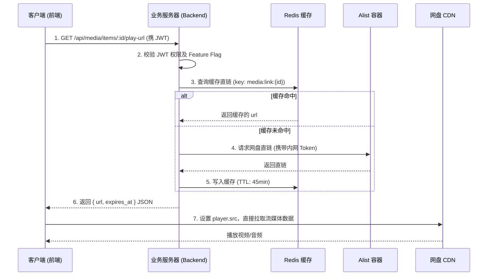
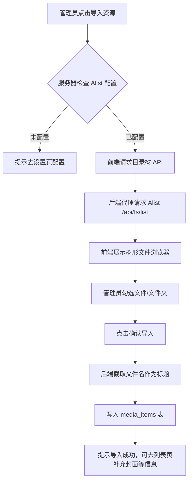
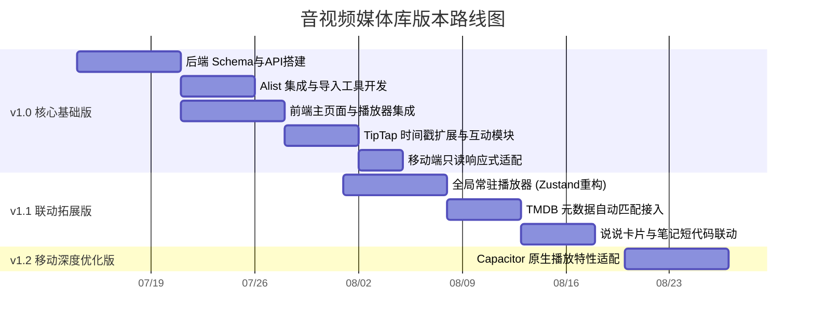

# super-note 音视频媒体库模块 产品需求文档 (PRD)

## 1. 文档概述

### 1.1 项目背景
super-note 是一款自建的、集笔记与社交（说说/日记）于一体的个人知识管理系统。为了满足家庭/小团队对于私有影视、音乐资源的管理与分享需求，计划在现有系统中新增「音视频媒体库」模块。

### 1.2 设计约束
*   **硬件资源极度受限**：服务器为 4核4G，剩余磁盘空间仅约 20GB，且公网带宽有限。
*   **海量资源托管**：面临 2TB+ 的高清影视和 MP3 音乐资源管理，资源实际存储于阿里云盘/夸克网盘，通过本地部署的 Docker 化 Alist 容器进行挂载。
*   **流量零消耗原则**：受限于服务器带宽，媒体库资源的播放必须实现“服务器 0 流量”，直接由客户端拉取网盘 CDN 数据。

### 1.3 核心目标
*   打造一个面向家庭/小团队的私有影视/音乐资源管理与分享平台。
*   支持多用户场景下的互动，包括资源互推、影评/乐评撰写与交流。
*   实现海量资源的极速录入与统一管理。
*   在严格的硬件约束下提供流畅的在线播放体验。

---

## 2. 用户角色与权限矩阵

系统复用现有 workspace 的角色体系（owner / admin / editor / commenter / viewer）。

| 功能模块 | 操作 | 权限要求 | 备注 |
| :--- | :--- | :--- | :--- |
| **系统设置** | 配置 Alist 信息 (地址、Token) | owner | 系统全局控制 |
| **资源管理** | 添加/编辑/删除 合集与单品 | owner, admin | 确保资源库的规范性 |
| | Alist 目录浏览导入 | owner, admin | |
| | JSON 批量导入 | owner, admin | |
| **资源消费** | 浏览、搜索、筛选资源 | 所有已登录用户 | |
| | 播放音视频资源 | 所有已登录用户 | |
| **社区互动** | 撰写、编辑自己的影评/短评/推荐 | 所有已登录用户 | |
| | 删除他人的评论/影评/推荐 | owner, admin | 与现有的 diary_comments 保持一致 |

---

## 3. 功能需求矩阵

### 3.1 v1.0 核心版本功能

#### 3.1.1 媒体库基础资源管理
*   **功能描述**：支持合集与单品的增删改查。合集与单品为一对多关系，单品也可以独立存在不属于任何合集。
*   **交互流程**：管理员在后台管理界面操作，支持基础信息的表单填报。
*   **验收标准**：
    *   成功创建、编辑、删除合集与单品信息。
    *   删除合集时，所属单品不被级联删除，而是解除关联关系。

#### 3.1.2 极速资源录入 (双模式)
*   **功能描述**：提供 Alist 目录浏览导入（主）与 JSON 批量导入（辅）两种模式。
*   **交互流程**：
    *   **Alist 模式**：点击「导入资源」-> 弹出 Alist 文件浏览器 -> 勾选目标文件/文件夹 -> 系统自动提取文件名作为标题，路径作为 `alist_path` -> 提交入库。
    *   **JSON 模式**：下载提供的数据模板 -> 按单合集+单品数组结构填写 JSON -> 上传导入。
*   **验收标准**：
    *   Alist 浏览器能正确展示网盘目录树。
    *   能智能截取文件名作为标题（v1.0 暂不请求外部 API）。
    *   JSON 导入支持平坦结构，解析无误。

#### 3.1.3 音视频在线播放
*   **功能描述**：媒体库详情页内嵌播放器，支持视频与音频的流畅播放。
*   **交互流程**：用户点击播放按钮 -> 前端请求后端获取带鉴权的直链 -> 后端优先读 Redis 缓存，无缓存则请求 Alist 获取 -> 前端拿到直链后赋给播放器。
*   **验收标准**：
    *   视频使用 react-player 播放，支持基本控制与全屏。
    *   音乐使用 react-h5-audio-player 播放。
    *   播放不经过业务服务器代理流量。

#### 3.1.4 搜索与发现体系
*   **功能描述**：提供多维度的资源检索手段。
*   **交互流程**：媒体库首页提供搜索框与筛选面板。
*   **验收标准**：
    *   支持标题/歌手名关键词搜索。
    *   支持按类型（视频/音乐）筛选。
    *   支持按合集浏览，并提供宫格/列表视图切换。
    *   支持基于 tags 体系的标签过滤。
    *   展示用户的最近播放历史。
    *   支持列表按添加时间/名称/播放次数排序。

#### 3.1.5 影评/乐评与短评互动
*   **功能描述**：用户可为单品撰写长篇影评或简短的短评，支持时间戳打点。
*   **交互流程**：
    *   **影评**：在详情页点击“写影评”，弹出 TipTap 编辑器，可通过新增的“插入当前时间”按钮插入播放时间点。
    *   **短评**：在评论区快捷输入框输入。
*   **验收标准**：
    *   富文本编辑器正常工作，支持时间戳插入。
    *   渲染出的时间戳（如 `[12:35](#t=755)`）点击可使当前页面的播放器跳转至对应进度。

#### 3.1.6 基础架构与入口适配
*   **功能描述**：UI 导航与移动端的基础适配。
*   **交互流程**：无缝融入现有系统。
*   **验收标准**：
    *   左侧 NavRail 存在独立的「媒体库」一级入口。
    *   说说右上角存在快捷入口（最近在听/在看）。
    *   PC 端功能完整，移动端界面响应式适配良好，移动端仅开放浏览和播放，隐藏管理入口。

### 3.2 v1.1 联动拓展版功能
*   **TMDB 元数据自动匹配**：在 Alist 导入或手动添加时，根据标题自动调用 TMDB API 补全封面图、简介、年份、类型等信息。
*   **说说分享卡片**：在说说模块可以直接以卡片形式分享媒体库中的合集或单品。
*   **笔记插入媒体短代码**：在常规笔记中，可以通过类似 `[media id=xxx]` 的短代码嵌入媒体播放块。
*   **全局常驻音乐播放器**：突破媒体库页面限制，在系统任意页面均可通过吸底或侧边栏悬浮窗控制音乐播放。

### 3.3 v1.2 移动端深度优化版功能
*   移动端专属的交互体验优化（滑动切歌、横竖屏无缝切换优化等）。
*   基于 Capacitor 的原生视频播放特性适配。

---

## 4. 核心业务流程 (v1.0)

### 4.1 媒体播放鉴权与直链获取流程



### 4.2 Alist 目录浏览导入流程



### 4.3 影评撰写与时间戳打点流程

```mermaid
flowchart TD
    A[用户在单品详情页播放视频/音频] --> B[点击撰写影评/长评]
    B --> C[弹出 TipTap 富文本编辑器]
    C --> D[编辑文字内容]
    D --> E{需要插入关键画面时间?}
    E -- 是 --> F[点击编辑器扩展栏「插入当前时间」按钮]
    F --> G[前端读取当前播放器 progress]
    G --> H[向编辑器插入 [MM:SS](#t=N) 格式标记]
    E -- 否 --> I[继续编辑]
    H --> I
    I --> J[提交保存入库]
```

---

## 5. UI/UX 规范

### 5.1 入口与导航
*   **NavRail**：图标采用胶片/音符复合 icon，处于 `NAV_CONFIG` 中独立层级。
*   **说说右上角**：微型胶囊卡片，显示“最后一次播放的媒体封面+标题缩略”，点击直达。

### 5.2 媒体库主页面布局
*   **顶部**：搜索框、资源类型 Tab（全部/视频/音频）、添加资源按钮（仅管理员可见）。
*   **左侧侧边栏**：标签过滤树、合集列表导航。
*   **主体内容区**：支持卡片式宫格（Cover 优先）和精简列表视图的切换。卡片上需展示标题、类型 icon、年份、播放次数。

### 5.3 单品详情页
*   **头部**：宽屏海报背景（模糊处理）叠加密集元数据（标题、年份、导演/歌手、标签、简介）。
*   **核心区**：播放器容器，占据核心视觉焦点。
*   **下方 Tab**：分为「影评/乐评」、「短评讨论」、「推荐语」。

### 5.4 响应式适配规则
*   **PC 端**：利用大屏优势，详情页可采用左侧视频+右侧评论流的分栏设计。
*   **移动端**：
    *   主页强制使用单列卡片或紧凑列表。
    *   详情页垂直堆叠：头部信息 -> 播放器 -> Tab 面板。
    *   隐藏所有编辑、删除、导入按钮，保持纯粹的消费体验。

### 5.5 封面图显示策略
*   前端 `<MediaCard />` 组件优先加载 `cover_url`。
*   若判断为本地附件路径（例如 `/api/attachments/...`），则正常加载。
*   无论外链还是本地链接，若触发 `onerror` 事件，立刻平滑切换为预设的系统占位图 (Placeholder)。

---

## 6. 非功能需求

### 6.1 性能
*   **播放首屏**：因使用网盘直链，首屏加载强依赖外网链路，系统需在直链请求阶段（后端 Redis 缓存命中）控制在 100ms 内，确保把时间留给 CDN 握手。
*   **图片加载**：本地上传的封面图必须经过 sharp 处理，限制为 300px 宽度的 WebP 格式，单张图片体积控制在 50KB 以下，保障列表页的滚动流畅度。

### 6.2 安全
*   **直链时效控制**：后端 Redis 缓存时间（45分钟）必须小于 Alist/网盘的真实失效时间（通常 1 小时），防止下发过期链接。
*   **网络隔离**：Alist 容器绝不暴露公网端口，super-note 后端仅通过 Docker 自定义 bridge 网络（内网）与其通信。
*   **直链截取风险**：虽然前端抓包可获得直链，但基于家庭/小团队的信任前提以及 1 小时失效机制，该风险处于可接受范围，不做复杂的加密混淆。

### 6.3 兼容性
*   前端视频播放器必须声明 `playsinline` 属性，以阻止 iOS Safari 默认的强制全屏行为，保障页面内联交互的完整性。

---

## 7. 版本路线图



---

## 8. 异常场景与降级策略

1.  **Alist 服务宕机或配置失效**
    *   **表现**：后端连接 Alist 失败。
    *   **策略**：媒体库页面进入全局 Empty State，提示“网盘连接失败”，并向管理员展示“前往设置重新配置”的快捷入口。普通用户仅看到维护提示。
2.  **播放直链突然失效**
    *   **表现**：播放器抛出 HTTP 403 或媒体加载错误。
    *   **策略**：前端捕获播放器 `onerror`，静默清理本地缓存状态并向后端重新发起获取直链的请求，重试 1 次。若依然失败，则弹窗提示用户网络异常。
3.  **网盘源文件被移动或删除**
    *   **表现**：后端请求 Alist 时返回 404 文件不存在。
    *   **策略**：该单品在前端显示为“资源不可用”的置灰状态，保留其影评和评论，不级联删除数据。
4.  **搜索无结果/合集为空**
    *   **策略**：展示精美的 Empty State 插画，并提供清空筛选条件或返回首页的按钮。管理员额外看到“立即导入资源”的引导按钮。

---

## 9. 验收清单

*   [ ] `system_settings` 中可成功保存 Alist 配置并测试通过。
*   [ ] 能通过可视化目录树勾选 Alist 中的文件，并成功批量导入为媒体库单品。
*   [ ] JSON 批量导入单合集数据无报错，数据完整入库。
*   [ ] 播放视频时，通过浏览器 Network 面板确认**大流量数据流直接指向网盘 CDN**，而非系统服务器。
*   [ ] Redis 中成功生成 `media:link:xxx` 缓存，且 TTL 不超过 45 分钟。
*   [ ] 普通 Viewer 角色用户尝试访问 `/api/media/import` 接口被拒绝 (403)。
*   [ ] 影评编辑器中点击插入时间，正确生成 `[MM:SS](#t=N)` 格式标记，并且阅读时点击该标记，播放器进度条发生跳转。
*   [ ] 模拟修改本地服务器可用空间至少于 1GB，上传封面图成功并被 sharp 压缩至 100KB 以内。
*   [ ] 手机端浏览器访问，页面不乱版，视频点击播放时不在 iOS 默认全屏原生播放器中打开（内联播放生效）。
